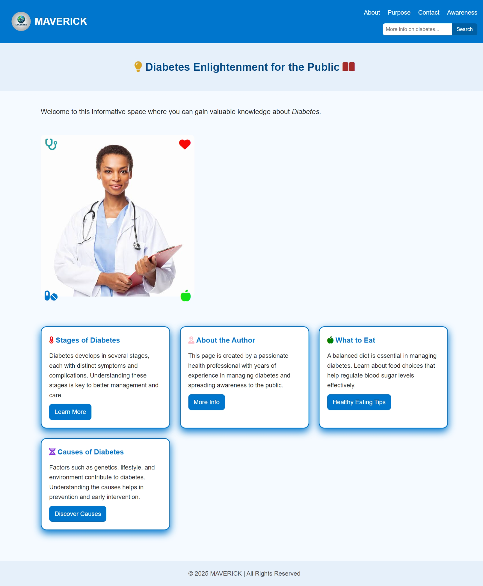

### INTRODUCTION
# Diabetes Awareness Website
This project aims to educate the public about diabetes, its risks, symptoms, prevention, and management. The website provides insightful information across multiple sections to promote awareness and healthy living.
## Table of Contents
- [Home Page](#home-page)
- [Awareness Page](#awareness-page)
- [About Page](#about-page)
- [Contact Page](#contact-page)
- [Features](#features)
- [Technolgies](#Technologies)
- [Installation](#installation)
- [Usage](#usage)
- [Contributing](#contributing)
- [License](#license)
## Landing Page

The landing page serves as the entry point to the website, offering an overview of the project's mission and guiding users to various sections. It includes:
- **Header**: Contains the website logo and navigation links.
- **Hero Section**: Features a welcome message and an introduction to the website's purpose.
- **Information Sections**: Provides brief insights into different aspects of diabetes awareness.
- **Footer**: Displays contact information and additional resources.
## Home Page
The home page offers detailed information about diabetes, including its types, causes, and preventive measures. Key components include:
- **Educational Content**: In-depth articles on diabetes risks, symptoms, and management strategies.
- **Interactive Elements**: Engages users with quizzes and infographics to enhance understanding.
- **Resource Links**: Directs users to reputable sources for further reading.
## About Page
The about page shares the motivation behind creating the website and introduces the author. It includes:
- **Author's Story**: Personal narrative explaining the inspiration for the project.
- **Mission Statement**: Outlines the goals and objectives of the website.
- **Approach**: Describes the methodology used to gather and present information.
## Contact Page
The contact page allows users to reach out for inquiries, feedback, or support. Features include:
- **Contact Form**: Users can submit their name, email, subject, and message.
- **Social Media Links**: Connects users to the project's social media profiles for updates and community engagement.
- **Additional Contact Information**: Provides alternative ways to get in touch.
## Features
- **Responsive Design**: Ensures the website is accessible and user-friendly across various devices.
- **Educational Resources**: Offers comprehensive articles and guides on diabetes awareness.
- **Interactive Tools**: Includes quizzes and calculators to help users assess their health risks.
- **Community Engagement**: Features a blog and forum for users to share experiences and support each other.

### Technologies Used: 
- **The section lists**: The main technologies used in the project like HTML, CSS, JavaScript,  and Git/GitHub for version control.

### Key Points:
- **General Setup**: Provides step-by-step instructions for installing, running, and contributing to the project.

## Installation
To set up the project locally, follow these steps:
1. **Clone the Repository**:
   ```bash
   git clone https://github.com/yourusername/diabetes-awareness-website.git